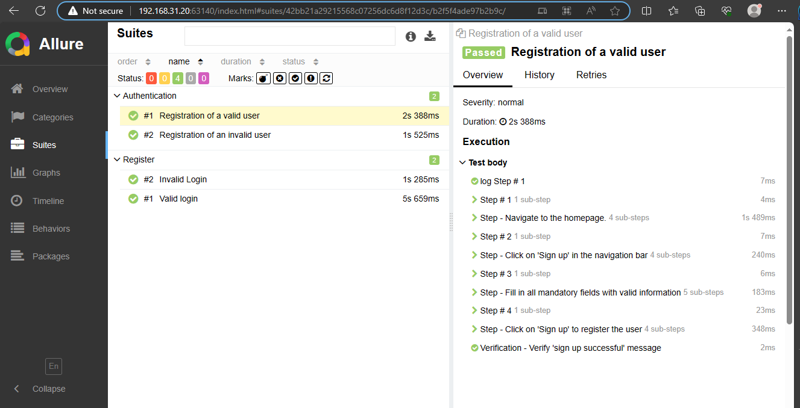

# cypress
This projet build an ui automated test cases implemented in cypress.

# Install node js 
sudo apt updatenode
sudo apt install nodejs
# NOTES
to work with allure reports the version of cypress should be 12.14.0 an upper version has a bug 
https://github.com/cypress-io/cypress/issues/27113
 # Commands
 just for the first time 
 > npm install -D cypress@12.14.0
 > npm i -D @shelex/cypress-allure-plugin (https://www.npmjs.com/package/@shelex/cypress-allure-plugin)
 > sudo npm install -g allure-commandline
 > npm init -y
# if the project is created just type 
> npm install

 npx cypress open
 npx cypress run --env allure=true
 npm run all
 unset GTK_PATH (to fix a java issue in vscode)
 allure open

 # run script 
 npm run all
 if all run well the view should be visible at <http://127.0.1.1:45327/>
 
